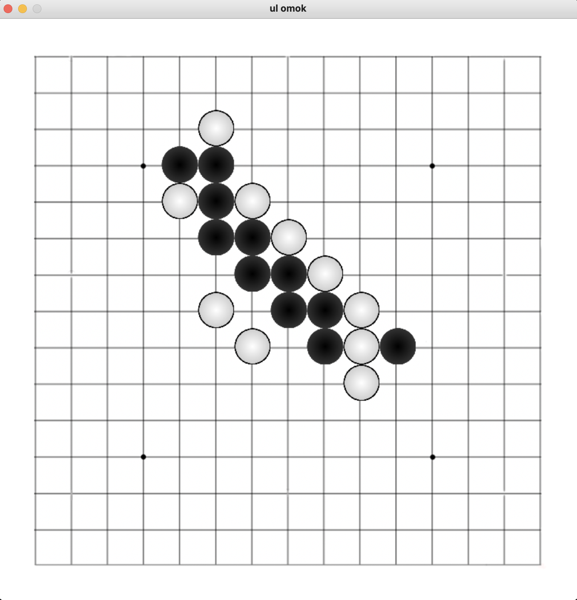
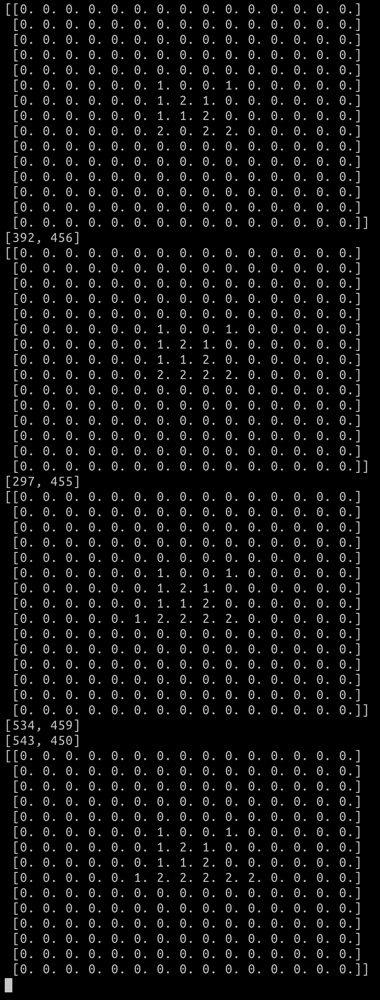

# gui_omok  

## explanation
main.py를 실행하면 게임이 시작되고  
pygame을 이용하여 만들었기 때문에 pygame을 설치해주셔야 정상적으로 실행됩니다.  
테스트는 Mac 환경에서만 진행해 봤지만 아마 pygame만 설치되어있다면 대부분에 환경에서 실행 될 겁니다.  
  
## game_ex
화면 원하는 곳에 마우스를 눌러주면 그 턴에 맞는 색깔의 돌이 놓아집니다.  
또 같은색 돌이 5개 연속으로 놓아지는 경우 그 색은 승리하게 됩니다.  
승리 판정이 나면 더 이상 게임에서 돌을 놓을 수 없게 됩니다.  
  
  
  
  
2021-08-26 commit 기준   
> 5개를 놓으면 이라는 승리판정만 만들었고  
> 승리 메세지, 다시하기 등등은 후에 만들 예정  
> rule도 5개를 놓는것과 중복 불가정도만 추가되었고 후에 렌주룰을 추가할 예정  

lang : Python  
> python3.7.0  

module  
> pygame  
> numpy  

